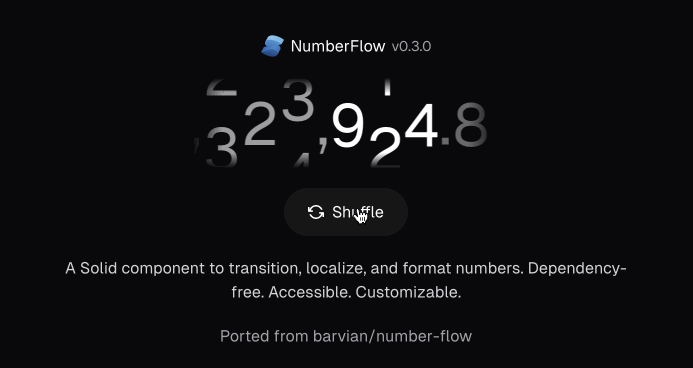

<p>
  
</p>

# solid-number-flow

<div align="center">

</div>

<div align="center">
  </img>
  <a href="https://www.npmjs.com/package/solid-number-flow" target="_blank">
  </img></a>
  </img>
  </img>
</div>

A SolidJS component to transition, format, and localize numbers. Forked from [@barvian/number-flow](https://github.com/barvian/number-flow).

## Quick start

Install it:

```bash
npm i solid-number-flow
# or
yarn add solid-number-flow
# or
pnpm add solid-number-flow
# or
bun add solid-number-flow
```

Use it:

```tsx
import solid-number-flow from 'solid-number-flow'

export default function Page() {
  const [value, setValue] = createSignal(398.43);

  return (
    <>
      <button onClick={() => setValue(Math.random() * 1000)}>Random</button>
      <NumberFlow value={value()} />
    </>
  )
}

```
